# Project Narrative: Development of an End-to-End Image-Based 9×9 Sudoku Solver

**CPECOG1 — Group 4 — Term 9 (2026)** — engineering narrative, methodology, and illustrated comparison plan.

*This document tells the full development story of the project — what was built, what was tried, what failed, and what was measured at every step — in neutral academic prose. It is organized so that its sections can be lifted directly into the paper draft (`CPECOG1 _Group 4 Project.md`): Section 3 ↔ Design, Section 5 ↔ Review of Related Literature, Sections 6–8 ↔ Results and Discussion, Section 9 ↔ Discussion/Recommendations.*

*All figures and tables cited in this document exist in the repository; the ones marked **[new]** are generated by `make_narrative_figures.py` (F2–F9) and `final_metrics_figures.py` (F10/F11) into `narrative_figures/`. All accuracy figures were produced by the project's own benchmark harness (`benchmark.py`) from labeled real-photo test sets; none are estimated.*

---

## 1. Executive Summary

The project is an end-to-end system that takes a photograph of a 9×9 Sudoku puzzle and returns its solution. The system detects the grid in the photograph, corrects perspective distortion, segments the grid into 81 cells, normalizes each cell through a binarization-and-cleanup preprocessing pipeline, recognizes the digits with a convolutional neural network (CNN), reconstructs the puzzle, and solves it with a constraint-propagation backtracking solver that is allowed to revisit the CNN's least-confident recognitions.

The project's central engineering finding is that **every stage is a bottleneck**: the puzzle-level goal is not met by a good digit classifier alone, because a puzzle with roughly 27 givens needs approximately 99% per-digit accuracy before a naive pipeline can solve it at all (0.8^27 ≈ 0.2% solve rate). The work therefore iterated on *all* stages — grid extraction, per-cell preprocessing, model architecture, confidence calibration, training-data curation, and the solver itself — and measured each iteration against a labeled benchmark rather than trusting qualitative impressions.

As of the final training run (2026-08-10, 21-epoch early-stopped GAP model, temperature-calibrated), the system recognizes 98.44% of the digits and 99.76% of the empty cells on the sealed 210-puzzle test partition, and reconstructs 90.0% of puzzles exactly (definite cells only). End-to-end from the photograph, 87.6% of grids are auto-detected and 91.63% of their digits recognized. All numbers in this document are measured by the project's own labeled benchmark; none are estimated.

## 2. Problem Statement and Design Constraints

A photograph of a Sudoku puzzle differs from a clean digital rendering in ways that compound:

- **Geometry.** The grid is photographed at an arbitrary angle and perspective; the page may be curved or partially cut off; other text may frame the grid.
- **Illumination.** Uneven lighting and shadows change local contrast across the grid, so a single global binarization threshold fails.
- **Print quality.** Thin grid lines survive binarization inside cell borders, ink bleeds and camera noise create specks, and digits can touch cell borders or split into disconnected strokes.
- **Domain shift.** Real photos are a different distribution from synthetic rendered digits; a model trained only on synthetic fonts is confidently wrong on photos.
- **Cascade error.** The solver needs every given digit to be correct. With k givens and per-digit accuracy a, the probability that all givens are correct is a^k; at 80% accuracy and 27 givens this is ≈0.2%.

The last point is the project's central constraint: **recognition accuracy, calibrated confidence, and a correction mechanism are not optional — they are the design requirements** (Section 5.7).

### 2.1 Calibration is a requirement, not a luxury

An uncalibrated softmax is overconfident: a wrong recognition with confidence above 0.9 was the dominant failure mode of the early system (Section 6.5). Confidence must be meaningful so that the solver can (a) trust high-confidence recognitions as hard constraints, and (b) know which cells to revisit.

### 2.2 Data integrity is a requirement

Evaluating a model on data it was trained on inflates every number. The project therefore sealed a 70/15/15 partition of the 1,400-image Lexski dataset once, before any training, and enforces that the test partition is never loaded by any training path (Section 4.4). An early 24-image evaluation sample was later found to be contaminated for photo-trained models (23 of its 24 images landed in the train partition); it is now used only as a smoke check for synthetic-only models.

## 3. System Architecture

The system is organized as three pillars connected by a single shared data pipeline:

```
photo ──► grid detection (contour → line-based quad)          [sudoku_core]
             │
             ▼
       perspective warp (four_point_transform, 600 px)
             │
             ▼
       81 row-major cells, fractional boundaries
             │
             ▼
   per-cell preprocessing: threshold → cleanup → letterbox 48×48   [shared by
             │                                                     training and
             ▼                                                     inference]
   CNN (double-conv, GAP head) ──► per-cell softmax (81 × 10)
             │                          │
             │                          └─► confidence-aware candidates
             ▼                              (best-first alternatives, 12
   recognized 9×9 grid                     least-confident order cells)
             │                          │
             └──────────────────────────┘
             ▼
   confidence-aware correction search: MRV backtracking + constraint
   propagation, release cells, change budget, re-sensing
             │
             ▼
           solution
```

| Pillar | Module | Responsibility |
|---|---|---|
| Computer vision | `sudoku_core.py` | Grid detection, perspective warp, cell extraction, solver engine |
| Learning | `digit_cnn.py` | Preprocessing pipeline, CNN, training, calibration, synthetic data generation |
| Evaluation & training | `benchmark.py`, `train_local.py`, `photo_data.py`, `sudoku_cnn_colab.ipynb` | Labeled benchmarking (recognition and end-to-end modes), local and Colab training, sealed photo splits |
| Deployment | `live_solver.py` | Real-time GUI: live camera / uploaded-image solving with the same pipeline |

The single most important architectural decision is that **training data and inference share the exact same cell-preprocessing code path** (Section 5.4): every synthetic, handwritten, and real-photo training sample is passed through the same `preprocess_cell` function the deployed system uses. This removes the classic train/inference skew that silently degrades deployed classifiers.

### 3.1 The live application

The pipeline is deployed as a real-time Tkinter GUI (`live_solver.py`): point a webcam at a printed puzzle — or upload a photo — and the app solves it live, roughly 3–4 passes per second. Three background threads keep the UI responsive: the model loads on one (weights plus the temperature sidecar, off the UI thread), capture runs on a second (DirectShow on Windows — MSMF leaks frame buffers with some drivers), and solving on a third with a **busy-gate** that guarantees at most one frame is in flight or pending, so the queue can never pile up while a slow pass runs. The preview overlays the detection result directly on the photo: the green quad is the detected grid, **white digits are recognized givens, yellow digits are cells the solver filled** — both drawn at the true bilinear cell centers of the warp. The side panel shows the Recognized and Solution 9×9 grids in 3×3 boxes, populated row-major so every label lines up with the overlay cell-for-cell. This "recognition painted on the photo" view is also an honest diagnostic: what the CNN actually read is visible at every cell — including its errors — instead of being hidden behind the printed digits. A `--smoke` flag solves one sample image and exits 0/1, giving the whole pipeline a CI-able health check.

## 4. Evaluation Methodology

All claims in this document come from `benchmark.py`, which evaluates labeled datasets in two separately-labeled modes:

- **RECOGNITION/SOLVER** — the dataset's ground-truth grid corners are used for the warp, isolating the CNN + preprocessing + solver from grid detection.
- **END-TO-END** — grid detection is fully automatic (contour → line-based quad). There is **no center-crop fallback**: detection failures are counted honestly in a "grid detection" rate and excluded from recognition metrics.

### 4.1 Datasets

| Dataset | Source | Use |
|---|---|---|
| **Lexski Sudoku Image Recognition** (1,400 photos) | Hugging Face | Primary labeled benchmark; ground truth = (9,9,10) per-cell flags + 4 grid keypoints; also the source of real-photo training cells under the sealed split |
| **Wichtounet Sudoku** (GitHub clone) | Kaggle mirror | Secondary labeled benchmark (V2 vs `mixed/` auto-detected, never mixed) |
| **Kaggle Sudoku Box Detection** (2,620 grid JPEGs) | Kaggle | Unlabeled end-to-end grid-detection verification (baseline 2026-08-04: 53.8% detection) |
| **MNIST / EMNIST** (60k / 252k) | torchvision | Handwriting supplements for digit classes 1–9 (digit 0 dropped; class 0 = empty) |
| **Curated print fonts** (~10 common fonts) | local render | Synthetic digit generation, dark-on-light |
| **Synthetic empties** | generated | Class-0 samples calibrated to the measured appearance of real photo empty cells |

### 4.2 Metrics

The headline metric is **solved-cell digit accuracy** (digits only, on definite cells). Supporting metrics: definite-cell accuracy, empty-cell accuracy, **exact grids** (full 81-cell recognized grid identical to ground truth on definite cells; candidate-only cells ignored), no-duplicate grids (valid Sudoku unit constraints), solve rate, **gt-preserving solves** (valid solution that keeps *every* ground-truth clue), per-digit accuracy, a wrong-cell **confidence report** (Case A: wrong with conf < 0.5; Case B: wrong with conf > 0.9), 9×9 position-accuracy matrices, solver node counts, and diagnostic extras: candidate-only cells read as digits (potential false clues), and an oracle run that re-solves failed puzzles with candidate-only cells emptied.

### 4.3 Why the benchmark is trustworthy

- Ground truth comes from the datasets' own labels, not from the system.
- Recognition and end-to-end modes are separate; end-to-end never gets a corner hint.
- The sealed split is enforced in code: `train_local.py` and the notebook's photo loader never load the test partition; `benchmark.py --split-file --split-name test` is the official evaluation path.
- Cell-level CSVs (`--cell-dump`) record per-cell diagnostics (threshold path, ink fractions, component counts, removals) so any number can be traced back to individual cells.

## 5. Techniques: From Primitive to Learned

This section is the technique spine of the project. For every stage it lists the primitive/classical alternatives, the chosen technique, the measured evidence, and the lesson. A consolidated table appears in Section 8.1 (Table 2).

### 5.1 Grid detection

**Primitive alternatives.** Connected-component or contour extraction on a binarized image, then fitting the largest quadrilateral by contour approximation (Ramer–Douglas–Peucker); Hough line detection to find the grid's long lines and intersect them into corners; corner/keypoint detectors. Contour approximation fails when the grid touches image borders (the contour opens) or when other quadrilaterals in the scene are larger; Hough line detection is more robust to partial occlusion but noisier.

**Chosen.** Contour-first with a line-based fallback: the largest plausible quadrilateral is warped directly; when contour detection fails, long lines are found and intersected into a quad. There is deliberately **no center-crop fallback** — a missed detection is counted as a miss, keeping the end-to-end number honest.

**Evidence.** On the sealed test set (end-to-end mode, final model), 184/210 grids (87.6%) are detected; recognition metrics on detected grids are 93.03% definite / 91.63% digit / 97.74% empty. The detection rate is the current ceiling on end-to-end performance and a standing recommendation target (Section 9). The line gate was also a bug source: line-spacing validation originally used the *requested* output size rather than the source image dimension, rejecting valid 300 px and 1200 px images; fixed to be source-relative (Section 6.4).

### 5.2 Binarization: global vs. adaptive thresholding

**Primitive alternative.** Global thresholding (Otsu's method — a single threshold chosen to minimize intra-class variance). One threshold cannot serve a page lit unevenly: shadows darken parts of digits below the threshold or brighten grid lines above it.

**Chosen.** Adaptive Gaussian thresholding (block 15, constant 7, inverted): a per-pixel threshold computed from a local window, which follows shading across the cell. A global Otsu pass survives **only** as a degeneracy gate — used solely when adaptive thresholding is clearly degenerate (washed-out, low-contrast cell: < 0.5% ink *and* blur std > 18). The two thresholds are never compared on ink fraction, so the fallback cannot silently replace a working adaptive result.

**Mechanics of the comparisons.** Each pixel's threshold is the mean of its local 15×15 Gaussian window minus a constant 7, inverted to make ink white-on-black; a large window with a small constant keeps the threshold following gentle shading while sitting well below the ink. The degeneracy gate is a pair of statistical comparisons over the *adaptive output and the blurred input*: if the thresholded foreground fraction falls below 0.5% (virtually no ink survived) **and** the blurred cell's intensity spread (std) exceeds 18 (the cell is contrasty rather than uniform — so the missing ink is a threshold failure, not a genuinely blank cell), the adaptive result is declared degenerate and Otsu's output replaces it **unconditionally**. The two thresholds are deliberately never compared against each other on ink fraction: the legacy pipeline compared them (`otsu_ink > adaptive_ink` ⇒ use Otsu), which let a degenerate global result silently clobber a working adaptive one on borderline cells. Downstream, the same comparison discipline repeats in the cleanup rules (Section 5.3): every removal decision is a shape statistic compared against a measured threshold (area/length < 6 px, aspect > 4, spans ≥ 70%, fractions of the full cell), all derived from the benchmark's error montages.

**Tried → found.** The legacy pipeline did not actually use a pure global threshold: it ran adaptive thresholding and then *retried with Otsu whenever Otsu's ink fraction exceeded adaptive's*. That ink-fraction comparison was the defect — on borderline cells a degenerate global result could silently replace a working adaptive one. The first redesign removed the comparison entirely, leaving Otsu as the pure degeneracy gate described above. A later idea — *retry with Otsu when a digit vanishes* — was implemented, measured, and **reverted**: it fixed 0 of the 7→0 cells and invented a false digit on an empty cell. The lost 7s are erased at the threshold/margin level, and no second global threshold can recover what adaptive thresholding already destroyed.

**Evidence.** The empty→digit error montages (Section 8, Figures F4b–F4d) show that the legacy pipeline's failures are dominated by *thresholded grid-line fragments* surviving into empty cells (median fragment thickness 1.7 px) — a thresholding artifact, not a classification artifact. The stage strip (Figure F3) shows the threshold output before and after cleanup.

### 5.3 Cell cleanup: hand-crafted geometry rules

**Primitive alternative.** "Keep the largest connected component" — the P0/P1 strategy. It fails in two ways: in *empty* cells, thin grid-line fragments can be the largest component (the CNN then reads a digit); in *digit* cells, a digit touching a border or split into pieces can be truncated or lost.

**Chosen (P2).** A shape-based cleanup on the thresholded, margin-stripped cell (10% margin strip):

- **Tiny components** (< 0.5% of the full cell area) removed;
- **Edge-to-edge line fragments** (thin: area/length < 6 px, and elongated: aspect > 4) removed;
- **One-border thin lines** (< 2.5 px thick, elongated, spanning ≥ 70% of the stripped region) removed;
- **L-shaped corner remnants** (< 6% area, ≥ 40% span in both dimensions) removed;
- **Split strokes conditionally re-joined** with a thin bridge (1–2 px line through the gap, not a rectangle fill — a fill makes a broken stroke look like a blob; gap ≤ 5 px, pieces aligned, each ≥ 0.5% of the cell);
- **Conservative empty rule**: if the largest *surviving* component is < 1% of the cell, the cell is forced all-black;
- **All surviving components are kept** — there is no largest-component step, so a digit is never truncated and a digit + stray speck reaches the CNN whole (the training data contains the same real-photo look).

**How the rules were derived (development diary).** Each rule exists because a measured failure mode demanded it:

1. **Tried: keep the largest connected component (P0/P1).** *Found:* in empty cells, a thresholded grid line can be the *largest* component — the CNN then reads a digit (empty accuracy 54.29% at P0). Measuring the offending survivors in the benchmark's empty→digit montages showed thin (median 1.7 px), elongated lines running from a cell border, often spanning edge-to-edge, plus L-shaped corner chunks.
2. **Tried: a wider margin strip (P1, 8%).** *Found:* border-attached clutter dies (empty accuracy 54.29% → 97.45%), but interior fragments and corner chunks survive, and the largest-component step still truncates digits split by thresholding.
3. **Tried: shape rules per measured failure class (P2).** Edge-to-edge lines (thin: area/length < 6 px, aspect > 4), one-border lines (< 2.5 px thick, elongated, ≥ 70% span), L-shaped corners (< 6% area, ≥ 40% span in both dimensions), tiny components (< 0.5% of the full cell). *Found:* empty accuracy 97.45% → 99.77%, exact grids 18 → 20 of 24. Figure F4a shows one such cell — a surviving edge-to-edge line, boxed in red, removed by the rule.
4. **Tried: rejoin split strokes with a rectangle fill.** *Found:* a fill gives a broken stroke the look of a filled blob (the CNN reads it as 8 or 0). *Fixed:* a thin 1–2 px bridge drawn through the gap (gap ≤ 5 px, pieces aligned, each ≥ 0.5% of the cell).
5. **Tried: an Otsu retry when a digit vanishes.** *Found:* fixed 0 of the 7→0 cells and invented a digit on an empty cell. *Reverted* — the loss happens at threshold/margin level; no downstream rule can recover it.
6. **Tried: keep only the largest surviving component.** *Found:* digits touching a border, or split into pieces, are truncated (the 7→0 group). *Fixed:* keep **all** surviving components — a digit + stray fragment reaches the CNN whole, and the training data contains the same real-photo look.
7. **Tried: the legacy empty rule (zero the cell when the largest component is below 0.5%).** *Found:* grid fragments can *exceed* 0.5% of a cell, so the rule let the CNN see them. *Fixed:* the conservative rule — if the largest *surviving* component is < 1%, the cell is forced all-black. The synthetic empty class was calibrated to the same measured appearance (~97% pure black, ~3% with thin surviving fragments at 5–15% ink), so the CNN's "empty" experience at training time matches inference.
8. **Swept the parameters** on the same low-epoch model: margin 0.10 is the optimum (definite accuracy rises 94.07% → 96.34% across 0.04–0.12; Figure F9); the default empty threshold (0.01) beats 0.005; corner span 0.3 ≡ 0.4.

**Evidence.** Table 1 (Section 6) quantifies the jump: the same low-epoch model goes from 77.47% definite / 54.29% empty (P0) to 95.54% / 97.45% (P1, adaptive + margin + largest-component) to 96.34% / 99.77% (P2, shape-based cleanup). Figure F2 shows the same empty cell across all three generations: P0 leaves 1.9% fragment ink (which the CNN reads as a digit), P1's wider margin already zeroes it here, and P2's shape rules handle the fragments that *survive* margins (Figure F4a). The montage trio in Section 8 (Figures F4b–F4d) shows the same benchmark error group — empty cells read as digits — shrinking across generations before the classification stage even changed.

**Lesson.** When the classifier's errors are concentrated in a small number of *morphological* patterns, targeted geometry rules — a primitive technique — outperform a bigger model, because the model would need to see thousands of those patterns to learn what three shape rules encode directly. The rules were derived from the benchmark's error montages, i.e., the evaluation loop drove the preprocessing design.

### 5.4 The training data pipeline

The data pipeline is the project's most-iterated component. Its design goal: produce a training set whose distribution matches what the deployed preprocessing sends to the CNN.

**Sources.**

| Source | Class coverage | Purpose | Volume |
|---|---|---|---|
| Curated print fonts (DejaVu, Arial, Times, Courier, Verdana, Georgia, Tahoma, Corbel, Segoe UI, Liberation, Free*) | digits 1–9 | canonical printed-digit morphology | ~4,000/class |
| MNIST / EMNIST | digits 1–9 | handwriting robustness | 60k / 252k |
| Real photo cells (Lexski, sealed train+val) | digits 1–9, empties | the actual deployment domain | 52,685 / 11,735 |
| Synthetic empty cells | class 0 | empty-class training data, calibrated to real empties (~97% pure black, ~3% thin surviving fragments at 5–15% ink) | 15,000 |

**Augmentation is applied to the RAW cell *before* preprocessing** (zoom 0.8–1.0, shift ±2 px via warp-translation with black borders, rotation ±8°, occasional print-weight erode/dilate, brightness/contrast, weak noise, occasional blur), and every sample then passes through the *same* `preprocess_cell` as inference. Rotation, for example, is applied before thresholding so that threshold artifacts of rotated digits appear in training.

**Balancing.** EMNIST's ~69% share would otherwise dominate the gradient; a source-balanced `WeightedRandomSampler` gives every source equal influence, and augmentation is applied lazily per epoch (no eager giant array copies — the old eager `np.stack` of ~300k samples OOM'd the Colab kernel).

**Versioning.** Cached packed arrays (EMNIST ~2.3 GB, photo per-partition caches) carry a `preprocess_version` marker; an old-format cache is regenerated, never silently reused. Model weights carry a key-set check that rejects incompatible architectures with an explicit error rather than loading garbage. The official MNIST/EMNIST test sets are kept separate from training pools.

**Evidence.** A 3-epoch training-infrastructure smoke achieved 95.3% on the *official* MNIST/EMNIST test sets (a genuine held-out score — the old random-split number was meaningless). The photo fine-tune's effect on the sealed test (wrong cells 1,393 → 235; Section 6.6) is the strongest single-data-pipeline result in the project.

**The primitive alternative** — train only on synthetic fonts, or on whatever photos happen to be available — was measured, not assumed: the synthetic-only GAP smoke scored 87.80% definite / 84.44% digit on the sealed test (Table 1, row 7) vs. 97.94% / 97.42% for the photo fine-tune (row 8). The multi-source, sealed, warm-started pipeline is the difference.

### 5.5 Digit recognition: CNN architecture evolution

**Primitive alternatives.** Template matching and feature-based OCR (shape descriptors + k-NN/MLP) were considered as baselines; the literature (LeCun 1998) and the expected scale of the task favor a CNN. Within CNNs, the project explored two axes.

**Architecture axis.** The original single-conv `DigitCNN` (with a `Linear(4608, 10)` flatten head) was replaced by a double-convolution network: two Conv3×3–BN–ReLU stages per block, channels 32 → 64 → 128, MaxPool2 between blocks, and a **global-average-pooling (GAP) head** (`AdaptiveAvgPool2d(1,1)` → Flatten → Dropout(0.3) → `Linear(128, 10)`). GAP removes the position-locked 48×48 flatten (1.3k head parameters vs. 46k) and the 48×48 input lock.

**Why retraining was forced.** Each pipeline change invalidated old weights: the P1-trained smoke model lost ~1.5 points of digit accuracy when evaluated under P2 (95.62% vs. 96.58% for the P2-retrained smoke — Section 6.4). The key-set validation and versioned caches exist precisely so that a stale architecture/weights combination fails loudly instead of silently degrading.

**Evidence.** Sealed-test numbers across the model generations: synthetic-only 84.44% digit (3-epoch smoke); photo fine-tune 97.42% digit (3-epoch smoke) → 98.44% digit, 99.76% empty, 90.0% exact (final 21-epoch model). Per-digit accuracy is fairly flat across digits (96.6%–99.2% on the final model), meaning errors are distributed rather than digit-specific (Figure F6a, F10).

### 5.6 Confidence calibration: temperature scaling

**Problem.** The raw softmax is overconfident; the correction search trusts cells with conf > 0.9 as hard constraints, so a wrong cell with conf > 0.9 (benchmark "Case B") is a *structured* failure: the search will not revisit it, and the puzzle is corrupted.

**Chosen.** Temperature scaling — a single scalar T minimizing softmax negative-log-likelihood on a validation split — fitted on the **photo validation split** (fitting on synthetic val calibrates the wrong distribution). Argmax is unchanged; only confidences move, so T cannot hurt accuracy, only trustworthiness. The temperature is saved as a sidecar (`<weights>.temperature.json`) and auto-loaded by the CLI and benchmark.

**Evidence.** On the 24-sample evolution runs, Case B wrong cells collapsed from 67 (P0) to 3 (P2 + retrained smoke + calibration) (Figure F6b). On the sealed test, the photo fine-tune cut Case B from 511 (synthetic-only) to 59.

### 5.7 Solving: backtracking, constraint propagation, and confidence-aware correction

**Primitive alternative.** Brute-force enumeration of 9^81 candidate grids is intractable.

**Chosen solver.** MRV backtracking with constraint propagation at every node: per-cell candidate domains encoded as 10-bit masks (bit 0 = "release" marker), row/column/box used-masks, naked-single and hidden-single propagation at every node, MRV branching only when no cell is forced, trail/undo, and a total node budget that aborts the whole search (the budget protects against corrupted puzzles: a node explosion *is* the diagnostic signal that the CNN corrupted the puzzle).

**Chosen correction search.** The plain solver cannot fix recognition errors, so the deployed path (`solve_with_correction`) is one integrated confidence-aware search:

- Non-order cells (the 69 cells not in the CNN's least-confident list) are fixed to the recognized values; duplicate digits among them are rejected upfront;
- Order cells (the 12 least-confident, `order_cap`) branch over their CNN candidate lists inside the same search engine; a guess duplicating a fixed digit is rejected on the spot (high-confidence cells act as hard constraints);
- **Class 0 = release**: the CNN can say "this cell is empty" and the solver fills it freely;
- A completed grid is accepted only if at most `change_budget` (default 4) recognized digits differ from the first-pass recognition — the cap keeps the search from wandering into a valid Sudoku unrelated to the photo;
- **Budget semantics (`budget_ref`)**: edits count against the *first-pass* recognition, so the budget cannot be gamed by the search;
- **Re-sensing (`solve_with_resensing`)**: between search rounds the working puzzle is updated to each re-sensed cell's new argmax — a changed CNN opinion actually reaches the search — while the budget keeps counting against the original recognition.

**How the search was built (development diary).**

1. **Tried: the plain solver on recognized grids.** *Found:* correctly recognized puzzles solve in milliseconds (mean 3 nodes at P1), but CNN-corrupted puzzles explode — node means of 20k–50k and node-limit hits that track the error rate (Figure F7). The node budget turned a potential hang into a *diagnostic*: a node explosion tells you the recognition corrupted the puzzle.
2. **Tried: branch the least-confident cells over their CNN candidates.** *Found:* duplicate digits among the fixed (high-confidence) cells made puzzles unsolvable → duplicates are rejected upfront, and a guess duplicating a fixed digit is rejected on the spot, so high-confidence cells act as hard constraints.
3. **Tried: order cells whose candidate list merely contained class 0.** *Found:* the search **looped** on a contradictory restricted domain — an order cell whose CNN candidates excluded the true value burned the entire node budget without ever releasing it. *Fixed:* branch first on an order cell whose candidate list *starts* with 0 (release is the first action when the CNN guessed empty), then fall back to cells whose list merely *contains* 0, with 0 kept LAST — a real correction is preferred over deleting a given.
4. **Tried: accept any completed grid.** *Found:* the search drifted into valid Sudokus unrelated to the photograph. *Fixed:* a completed grid is accepted only if at most `change_budget` (default 4) recognized digits differ, and the budget counts against the FIRST-pass recognition (`budget_ref`) — so re-sensing cannot game it.
5. **Tried: re-sense low-confidence cells between rounds.** *Found:* a changed CNN opinion never reached the search — it was stranded in a stale working grid. *Fixed:* `solve_with_resensing` updates the working puzzle to each re-sensed cell's new argmax between rounds, while the budget keeps counting against the original recognition.
6. **Diagnosed, not fixed:** the HF dataset's *candidate-only* cells (no definite label) are read as digits by the CNN anyway — 478/577 on the 24-sample — and reach the solver as possible false clues. The oracle diagnostic (re-solving failed puzzles with those cells emptied) solved only 1/164 on the sealed test: the remaining failures are genuine recognition errors, not solver failures.
7. **The case of `3bor2sty6q0d1`** — the one puzzle that consistently regressed across every model (Figure F8, plus its 17-cell stage montage `v5_3bor_wrongcells_montage.png`): 13 of its 81 cells are read wrong by the P3 smoke, digits 2/5/7 flip on near-identical inputs, and the correction search cannot recover 13 errors within a budget of 4. It is the cleanest illustration of why recognition accuracy, not solver cleverness, is the binding constraint.

**Evidence.** The 24-sample runs show the search working as designed: solver node means vary from 3 (P1: nearly-perfect recognition → trivially solved) to ~20k–50k (corrupted puzzles hitting node limits — Table 1, Figure F7), and the node-limit hits track the CNN's error rate. On the sealed test, solve rate is 18.6% despite 90.0% exact grids — a single wrong clue makes a puzzle unsolvable within budget, which is precisely why recognition accuracy and calibration, not solver cleverness, dominate the final metric. The gt-preserving oracle (3/164 of failed puzzles solve when candidate-only cells are emptied) shows that candidate-only cells, not the solver, are a major remaining error source.

## 6. Iteration History

This section is the chronological account. Pipeline generations are named **P0 → P3** (Table 1). Model generations are named by architecture (legacy single-conv → double-conv GAP) and training corpus (synthetic-only → photo fine-tuned). The 24-sample numbers in Table 1 all use the same evaluation mode (recognition), the same 24-puzzle sample, and only the listed pipeline/model changes — so each row isolates one change.

| # | Run | Pipeline | Model | Definite | Digit | Empty | Exact | Solve | Wrong cells (A/B) |
|---|---|---|---|---|---|---|---|---|---|
| 1 | P0 legacy baseline | P0 (frozen legacy) | low-epoch | 77.47% | 88.14% | 54.29% | 2/24 | 0/24 | 308 (101/67) |
| 2 | P1 first redesign | P1 (adaptive + margin, largest component) | low-epoch | 95.54% | 94.66% | 97.45% | 18/24 | 4/24 | 61 (12/11) |
| 3 | P2 current pipeline | P2 (shape-based cleanup) | low-epoch | 96.34% | 94.76% | 99.77% | 20/24 | 6/24 | 50 (5/21) |
| 4 | P2 + stale smoke | P2 | P1-trained smoke | 96.93% | 95.62% | 99.77% | 18/24 | 5/24 | 42 (10/5) |
| 5 | P2 + P2 smoke | P2 | P2-retrained smoke | 97.59% | 96.58% | 99.77% | 20/24 | 5/24 | 33 (11/3) |
| 6 | P3 engineering fixes | P2 + P3 fixes | P2-retrained smoke | 97.81% | 96.90% | 99.77% | 20/24 | 5/24 | 30 (16/3) |
| 7 | GAP synth smoke (sealed 210) | P2 | 3-epoch GAP, synthetic-only | 87.80% | 84.44% | 99.60% | 68.6% | 15.7% | 1,393 (259/511) |
| 8 | GAP photo smoke (sealed 210) | P2 | 3-epoch GAP, photo fine-tune | 97.94% | 97.42% | 99.76% | 82.9% | 17.1% | 235 (57/59) |
| 9 | GAP photo FINAL (sealed 210) | P2 | 21-epoch GAP, full multi-source | 98.73% | 98.44% | 99.76% | 90.0% | 18.6% | 145 (28/34) |

*Table 1 — Pipeline evolution on the 24-puzzle HF sample (rows 1–6) and the sealed 210-puzzle test (rows 7–9, different sample — see Section 7). All values are measured by `benchmark.py`. Rows 1–6 share one model family; rows 4–6 share one smoke model; rows 8–9 share the photo-fine-tuned training corpus, differing only in training length.*

### 6.1 P0 — the frozen legacy pipeline

The starting point was a conventional pipeline: adaptive thresholding with an Otsu *retry* gated by an ink-fraction comparison (Section 5.2), a 4% margin strip, **keep the largest connected component**, a weak empty rule (largest component < 0.5% → black), letterboxed resize. Measured on the 24-puzzle sample with a low-epoch model: 77.47% definite-cell accuracy, **54.29% empty-cell accuracy** (nearly half of all empty cells were read as digits), 2/24 exact grids, 0/24 solves, and 67 wrong cells with confidence above 0.9. The empty-cell failure dominated: thresholded grid-line fragments survived the largest-component step and the CNN read them as digits. The lesson, visible in the P0 error montages (Figure F4b), was that **preprocessing, not the classifier, was the binding constraint**.

### 6.2 P1 — adaptive thresholding and margin strip

The first redesign replaced global thresholding with adaptive Gaussian thresholding (with the Otsu degeneracy gate) and kept a margin strip. Same model, same sample: definite 77.47% → 95.54%, empty 54.29% → 97.45%, exact grids 2 → 18 of 24. Solver node means dropped to 3: the puzzle was essentially solved by recognition alone.

### 6.3 P2 — shape-based cleanup

The P1 leftover problem was fragments that survived the largest-component rule. P2 replaced "largest component" with the shape-based cleanup of Section 5.3 (no largest-component step, fragment/corner/tiny rules, split-stroke bridge, conservative empty rule). Same model: empty accuracy 97.45% → 99.77%, definite 95.54% → 96.34%, exact 18 → 20 of 24. Parameter sweeps (same low-epoch model) confirmed the defaults: margin 0.04 = 94.07%/12 exact, 0.08 = 96.12%/18, **0.10 = 96.34%/20**, 0.12 = 96.20%/20; empty-threshold 0.005 = 95.90%/19 (0.01 better); corner-span 0.3 ≡ 0.4.

### 6.4 P3 — engineering fixes and the train/inference mismatch

Three engineering defects were found and fixed (same model, only code changed):

1. **Fractional cell boundaries.** `size // 9` truncates (600 → 66 px), misaligning every later row/column and discarding the last 6 px of the warp. Boundaries are now placed at rounded i·h/9 positions. Effect measured on digit 5: 96.5% → 99.1%.
2. **Source-relative line gate.** Line-spacing validation used the requested output size instead of the source dimension, rejecting valid 300 px and 1200 px images; now source-relative.
3. **Correction-search fixes.** Release-branching (a CNN "empty" opinion is the first action tried), the `budget_ref` semantics, and the re-sensing working-grid update (Section 5.7).

Net effect (rows 5 → 6): definite 97.59% → 97.81%, digit 96.58% → 96.90%, wrong cells 33 → 30, digit-5 96.5% → 99.1%, e2e detection 23/24.

**The mismatch lesson.** Rows 4–5 isolate the train/inference mismatch: the P1-trained smoke under P2 (95.62% digit) vs. the P2-retrained smoke (96.58%) — ~1 point lost purely because the model was trained under the previous preprocessing. This motivated the weight key-set validation and the versioned caches.

### 6.5 Architecture and calibration (GAP head, temperature scaling)

The old single-conv flatten model was replaced by the double-conv GAP `DigitCNN` (Section 5.5), and temperature scaling was added (Section 5.6). This was a required retrain (the old `digit_cnn.pth` weights are rejected by the key-set check). The synthetic-only 3-epoch GAP smoke (row 7) was the first model to run the *sealed* 210-puzzle benchmark: 87.80% definite, 84.44% digit, 1,393 wrong cells, 511 Case B — the expected result of training on synthetic data only.

### 6.6 Photo-domain fine-tuning under the sealed split

The decisive iteration: a warm-start fine-tune (lr 1e-4) of the synthetic GAP model on the sealed train+val photo partitions (52,685 train / 11,735 val definite cells, extracted through the same warp/preprocess path as the benchmark), with model selection and temperature fitting on the photo *validation* split. On the sealed test (row 8): definite 87.80% → 97.94%, digit 84.44% → 97.42%, exact 68.6% → 82.9%, wrong cells 1,393 → 235, Case B 511 → 59. End-to-end on the same model: detection 184/210, digit 90.52% on detected grids.

**The final run.** The full training configuration (epochs=40, multi-source: synthetic fonts + MNIST + EMNIST + empty cells + real photo cells, batch 256, AdamW lr 3e-4, early stopping) ran on the same sealed train+val partitions and early-stopped at 21 epochs (best epoch 19: validation score 0.9933, photo-val accuracy 99.47%). Temperature was refit on the photo validation split (T = 1.162). On the sealed test (row 9): definite 97.94% → 98.73%, digit 97.42% → 98.44%, exact grids 82.9% → 90.0% (189/210), wrong cells 235 → 145, Case B 59 → 34, solver node-limit hits 19 → 13. End-to-end: detection 184/210 unchanged, digit 90.52% → 91.63%. Notably, the longer run reached these numbers **without** the smoke's warm start — source-balanced multi-epoch training replaced initialization as the decisive factor.

## 7. Results

All numbers below are from the FINAL 21-epoch model (`models/digit_cnn.pth`, temperature T = 1.162) on the sealed 210-puzzle test partition (2026-08-10).

### 7.1 Recognition (sealed 210-puzzle test, final model)

| Metric | Value |
|---|---|
| Definite-cell accuracy | 98.73% (11,269/11,414) |
| Digit accuracy (solved cells) | **98.44%** (8,749/8,888) |
| Empty accuracy | 99.76% (2,520/2,526) |
| Exact grids (definite cells) | 90.0% (189/210) |
| No-duplicate grids | 21.0% (44/210) |
| Solve rate (valid, bounded correction) | 18.6% (39/210) |
| gt-preserving solves | 0.5% (1/210) |
| Wrong cells — Case A (conf < 0.5) / Case B (conf > 0.9) | 28 / 34 of 145 |
| Solver nodes (mean / max / limit hits) | 22,378 / 203,287 / 13 |
| Cells re-sensed | 5,552 |
| Candidate-only cells read as digits | 4,205/5,596 |
| Oracle (failed puzzles solved with candidate cells emptied) | 3/164 |
| Per-digit accuracy (1–9) | 96.6 / 98.8 / 98.9 / 98.8 / 98.4 / 98.0 / 98.4 / 99.2 / 98.8 |

### 7.2 End-to-end (same model, auto grid detection)

| Metric | Value |
|---|---|
| Grid detection | 87.6% (184/210; contour 183, line 1) |
| Definite accuracy (detected only) | 93.03% |
| Digit accuracy (detected only) | 91.63% |
| Empty accuracy (detected only) | 97.74% |
| Exact grids (of detected) | 72.8% (134/184) |
| Solve rate (of detected) | 15.8% (29/184) |

### 7.3 Reading the results

- Recognition accuracy is high and per-digit flat (96.6–99.2%); the remaining wrong cells are now a **minority** of Case B (34/145, 23% — down from 25% of a larger wrong set at the smoke), so temperature scaling plus longer training moved the error mass into low-confidence Case A, which the correction search can revisit. The confusion matrix (Figure F10) shows no digit-pair confusion cluster; errors are spread across classes.
- The gap between exact grids (90.0%) and solve rate (18.6%) is the cascade constraint of Section 2: one wrong clue per puzzle typically makes the puzzle unsolvable within the change budget. The candidate-only-cells diagnostic shows that ~4,200 candidate-only cells are read as digits — the largest identifiable upstream error source; the oracle (3/164) shows that emptying them would fix few puzzles, so the remaining errors are real recognition errors, not solver failures.
- The end-to-end gap vs. recognition is the detection step: 184/210 grids found, and recognition on auto-detected grids is ~7 points lower — warps from imperfect detection stress the same preprocessing/CNN. Per-position heatmaps (Figure F11) show accuracy is flat across the grid in recognition mode, with the bottom-right corner slightly weaker in end-to-end mode.

## 8. Illustrated Comparison Plan

This section is the plan for the document's illustrative comparisons, current state first. **Table 2** consolidates the primitive-vs-learned spine of Section 5.

### 8.1 Table 2 — Primitive vs. learned technique inventory

| Stage | Primitive/classical options | Chosen technique | Measured evidence |
|---|---|---|---|
| Grid detection | contour approximation; Hough lines; corner detectors | contour-first, line-fallback quad, honest e2e | detection 87.6% (final); line gate fixed to be source-relative |
| Binarization | global Otsu (one threshold) | adaptive Gaussian (block 15, C 7) + Otsu degeneracy gate | P0→P1 empty accuracy 54.3%→97.5% |
| Cell cleanup | keep largest component; morphology | shape rules: fragments, corners, tiny, bridge, conservative empty | P1→P2: empty 97.5%→99.8%; error montages (F4) |
| Data sources | synthetic only; whatever photos exist | curated fonts + MNIST/EMNIST + sealed photo cells + calibrated empties, balanced | row 7 vs. 8: wrong cells 1,393→235 |
| Classification | template matching; feature + k-NN/MLP; single-conv flatten CNN | double-conv GAP CNN, 48×48, key-set validated | final sealed 98.44% digit |
| Calibration | raw softmax | temperature scaling on photo val (sidecar) | Case B 511→59 (sealed) |
| Solving | brute force | MRV + constraint propagation + confidence-aware correction (release, budget, re-sensing) | solve 18.6% (final); node-limit hits as corruption diagnostic |

### 8.2 Figure plan

| ID | Content | Source | Status |
|---|---|---|---|
| F1 | System flowchart | paper draft Fig. 1 | exists (embedded in the paper) |
| F2 | Same cell through ALL THREE pipeline generations: P0 (frozen) / P1-style (reconstructed) / P2 — digit row + empty row | `make_narrative_figures.py` | **[new] generated** — `narrative_figures/fig_f2_pipeline_generations.png` |
| F3 | One cell through every preprocessing stage + diagnostics | `make_narrative_figures.py` | **[new] generated** — `narrative_figures/fig_f3_stage_strip.png` |
| F4a | Fragment anatomy: an empty cell's thresholded fragments, boxed in red and labeled by the shape rule that removed them, vs. the cleaned output | `make_narrative_figures.py` | **[new] generated** — `narrative_figures/fig_f4_fragment_anatomy.png` |
| F4b–F4d | The empty→digit error montage across generations (the dominant failure shrinking) | benchmark `--cell-montage` | exists — `results/figures/baseline_montage_recognition_empty_to_digit.png`, `results/figures/ab_montage_recognition_empty_to_digit.png`, `results/figures/v5smoke2_montage_recognition_recognition_empty_to_digit.png` |
| F5 | Benchmark grid figures (recognized vs. GT, per-puzzle) | benchmark | exists — `results/figures/bench_gap_photo_recognition.png`, `results/figures/bench_gap_photo_e2e.png`, `results/figures/fix_recognition_recognition.png` |
| F6a | Per-digit accuracy across generations | `make_narrative_figures.py` | **[new] generated** — `narrative_figures/fig_f6a_per_digit_accuracy.png` |
| F6b | Wrong-cell confidence cases (A/B) across generations | `make_narrative_figures.py` | **[new] generated** — `narrative_figures/fig_f6b_wrong_cell_confidence.png` |
| F7 | Solver node counts (mean/max + node-limit hits) per run — the corruption diagnostic | `make_narrative_figures.py` | **[new] generated** — `narrative_figures/fig_f7_solver_nodes.png` |
| F8 | The `3bor2sty6q0d1` case: GT / recognized-with-errors / solution | `make_narrative_figures.py` | **[new] generated** — `narrative_figures/fig_f8_solver_case.png` |
| F9 | The P2 parameter sweep (margin/empty/corner): definite accuracy + exact grids | `make_narrative_figures.py` | **[new] generated** — `narrative_figures/fig_f9_margin_sweep.png` |
| F10 | Confusion matrix on the final run's definite cells (counts + recall) | `tools/final_metrics_figures.py` | **[new] generated** — `narrative_figures/fig_f10_confusion_matrix.png` |
| F11 | Per-position accuracy + sample-count heatmaps on the sealed test | `tools/final_metrics_figures.py` | **[new] generated** — `narrative_figures/fig_f11_position_heatmaps.png` |
| R1 | Global vs adaptive thresholding on the same cells (synthetic shaded + real photo), with the degeneracy-gate statistics | `tools/make_reference_figures.py` | **[new] generated** — `narrative_figures/ref_r1_thresholding_compare.png` |
| R2 | Temperature scaling: fitted NLL(T) curve (photo val) + reliability diagram pre/post calibration (sealed test cells, ECE) | `tools/make_reference_figures.py` | **[new] generated** — `narrative_figures/ref_r2_calibration_reliability.png` |
| R3 | Training history from the final checkpoint: train/val loss + validation curves, best epoch + early-stopping patience window | `tools/make_reference_figures.py` | **[new] generated** — `narrative_figures/ref_r3_training_history.png` |
| R4 | DigitCNN architecture schematic (double-conv 32→64→128 + GAP head) with real parameter counts | `tools/make_reference_figures.py` | **[new] generated** — `narrative_figures/ref_r4_cnn_architecture.png` |
| R5 | Augmentation grid: one digit under every augmentation, each through the shared preprocessing path | `tools/make_reference_figures.py` | **[new] generated** — `narrative_figures/ref_r5_augmentation_grid.png` |
| R6 | Training-source volumes + naive vs balanced (WeightedRandomSampler) source shares | `tools/make_reference_figures.py` | **[new] generated** — `narrative_figures/ref_r6_data_balance.png` |
| R7 | Class-0 training data: synthetic empties vs real photo empties with full-population purity statistics | `tools/make_reference_figures.py` | **[new] generated** — `narrative_figures/ref_r7_empty_cells_synth_vs_real.png` |

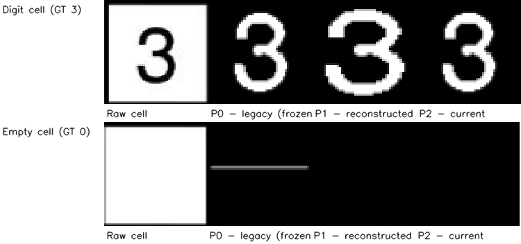

*Figure F2. The same two cells from a real photograph through all three preprocessing generations: P0 (legacy, frozen), P1-style (reconstructed from the study-era notes — the exact P1 code was superseded by P2), and P2 (current). Top row: a digit cell — every generation preserves it. Bottom row: an empty cell — P0 leaves 1.9% of the cell covered in thresholded grid-line fragments (which the CNN reads as a digit, the dominant P0 failure), P1's wider 8% margin already zeroes this particular fragment, and P2's shape rules handle the fragments that survive margins (Figure F4a).*

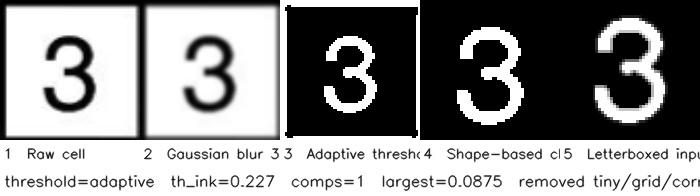

*Figure F3. A real digit cell through every stage of the current (P2) pipeline, with the per-cell diagnostics: adaptive thresholding (block 15, constant 7, inverted), shape-based cleanup (margin strip, fragment/tiny/corner removal, split-stroke bridge, conservative empty), and letterboxed 48×48 input. The pipeline is identical at training time and inference time.*

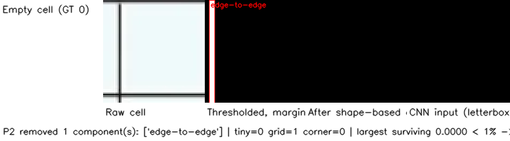

*Figure F4a. The preprocessing failure anatomy, on an empty cell whose fragment survives the margin strip: the thresholded cell (second panel) with every component the P2 shape rules remove boxed in red and labeled by rule (edge-to-edge line / one-border line / corner chunk / tiny). The third panel is the cleaned output — the cell is forced all-black by the conservative empty rule — and the footer lists the per-rule removal counts. This is what the "keep the largest component" strategy of P0/P1 fed to the CNN as a digit.*


*Figures F4b–F4d. The same benchmark error group — empty cells read as digits — across the three generations (recognition mode, same model family where applicable). The failure is pervasive at P0 (thin thresholded grid-line fragments surviving as the "largest component"), shrinks at P1 (wider margin), and is nearly gone at P2 (shape rules + conservative empty). The montage panels show the preprocessing stages of each offending cell.*

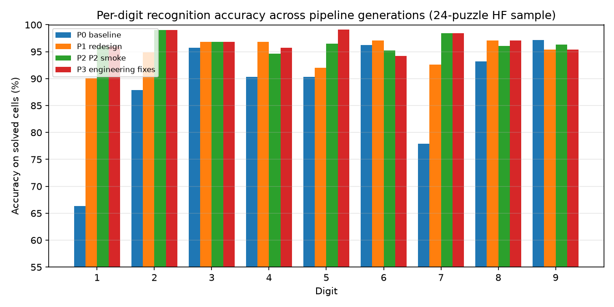

*Figure F6a. Per-digit accuracy (solved cells, recognition mode, 24-puzzle sample) for four representative runs: P0 + low-epoch model, P1 + low-epoch model, P2 + P2-trained smoke, P3 + same smoke. Digit 5's improvement from P0 to P3 (90.3% → 99.1%) includes the fractional-cell-boundary fix of P3.*

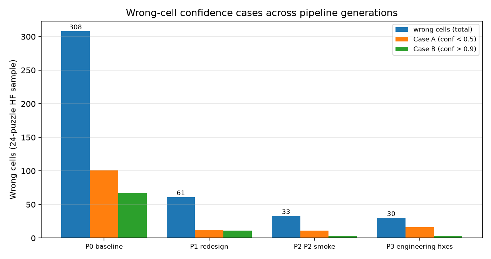

*Figure F6b. Wrong cells decomposed by confidence for the same four runs. Case B (wrong with conf > 0.9) — the cells the correction search will trust — collapses from 67 (P0) to 3 (P3), showing the joint effect of preprocessing, retraining under the matching pipeline, and temperature calibration.*

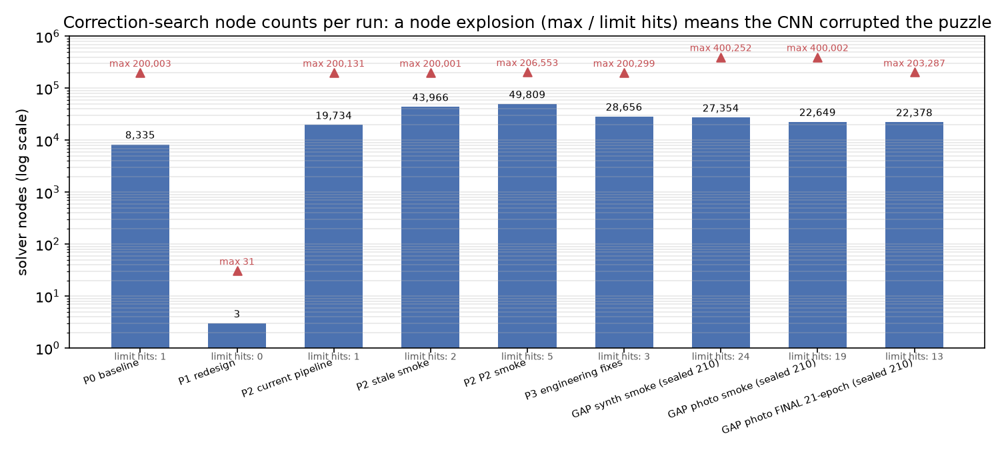

*Figure F7. Correction-search node statistics per run (log scale): mean nodes (bars), max nodes (triangles), node-limit hits (bottom labels). P1's mean of 3 nodes is a puzzle essentially solved by recognition alone; the ~20k–50k means with maxes at the 200k/400k limits are CNN-corrupted puzzles — the search's node budget turns what would be a hang into a corruption diagnostic. The sealed-test photo run (rightmost) still hits the limit 19 times.*

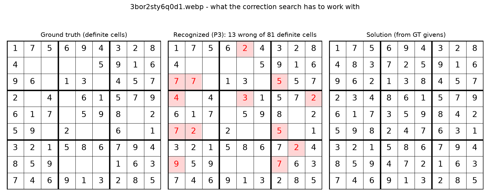

*Figure F8. The consistently-regressing puzzle: ground-truth grid (left), the P3 recognition with all 13 wrong cells highlighted in red (center), and the solution computed from the ground-truth givens (right). Digits 2/5/7 flip on near-identical inputs (see also `v5_3bor_wrongcells_montage.png`); with 13 errors and a change budget of 4, no correction search can converge — the puzzle is a controlled experiment in why recognition accuracy dominates the solve rate.*

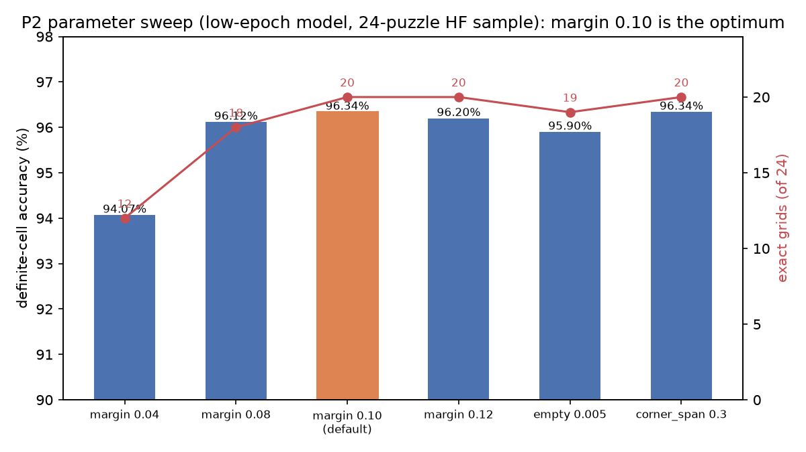

*Figure F9. The P2 parameter sweep (same low-epoch model, 24-puzzle sample): definite-cell accuracy (bars) and exact grids (red line) for margin 0.04–0.12, the empty-threshold alternative, and corner-span 0.3. Margin 0.10 (orange) is the measured optimum — 96.34% definite accuracy and 20/24 exact grids.*

### 8.3 Reference figures (intro-ML teaching support)

The figures below explain the classical techniques and machine-learning concepts the project relies on, with real project data. They are intended as support material for the course write-up (Section 5).

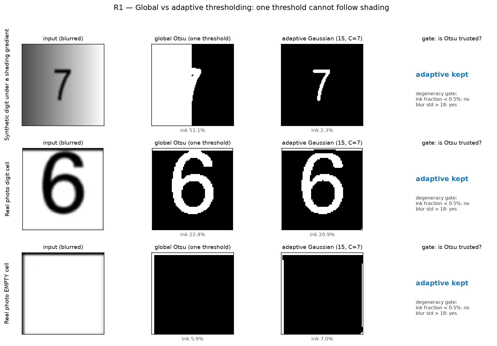

*Figure R1 (Section 5.2). The core thresholding lesson: one global threshold (Otsu) cannot follow shading across a cell. Top row — a rendered digit under a synthetic left-dark → right-bright gradient: Otsu loses the digit on the dark side while adaptive thresholding (per-pixel threshold from a local 15×15 window) recovers it. Middle/bottom rows — the same comparison on real photo cells. The right column shows the degeneracy gate's verdict and statistics: Otsu is only trusted when the adaptive output is clearly degenerate (ink fraction < 0.5% AND blur std > 18).*

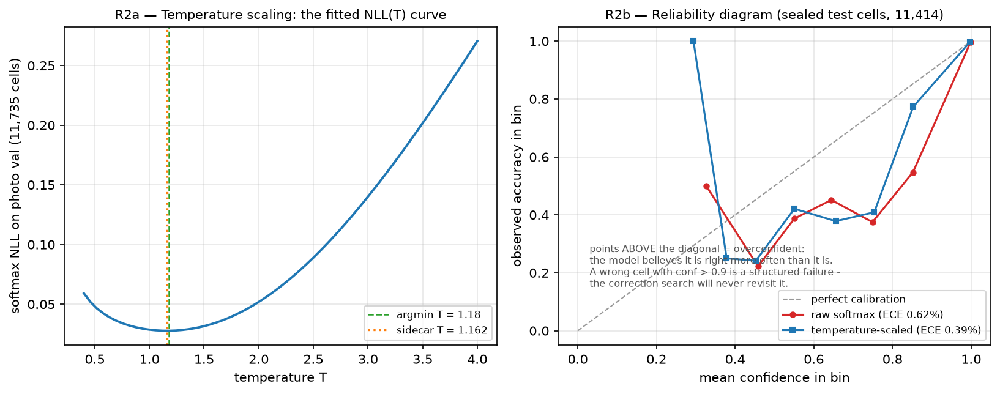

*Figure R2 (Section 5.6). Left: the fitted NLL(T) curve for temperature scaling — the sidecar T = 1.162 matches the NLL optimum on the photo validation pack. Right: a reliability diagram on the sealed-test cells (the deployment distribution): confidence-binned accuracy vs confidence. Points above the diagonal are overconfident predictions — a wrong cell with confidence > 0.9 is a *structured* failure, because the correction search will never revisit it. ECE is reported for both raw and scaled softmaxes.*

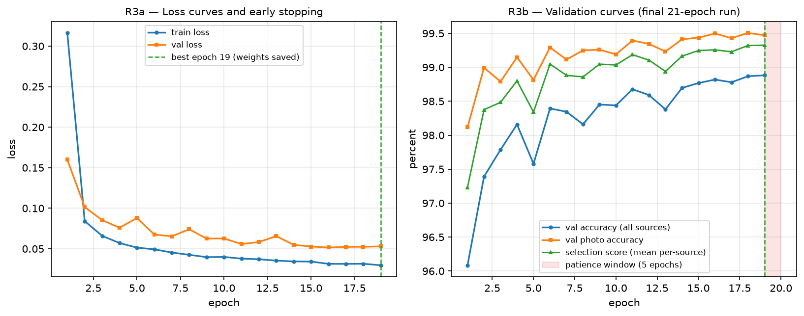

*Figure R3 (Sections 5.5, 6.6). The final model's training history from the Colab checkpoint (19 epochs recorded): train/validation loss, validation accuracy, and the selection score, with the best epoch (weights saved) and the 5-epoch early-stopping patience window marked. The selection score is the mean of per-source accuracies — photo accuracy is tracked separately since the deployment domain is photos.*

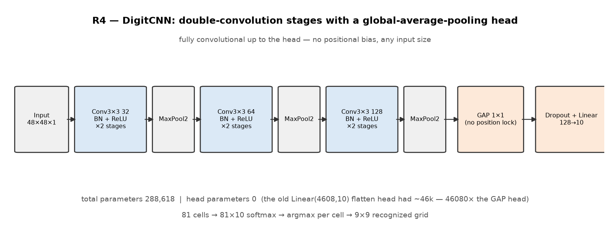

*Figure R4 (Section 5.5). The DigitCNN architecture: two Conv3×3–BN–ReLU blocks per stage (32 → 64 → 128 channels) with MaxPool2 between stages, then a global-average-pooling head (1×1) followed by Dropout and a 128→10 linear layer. Everything before the head is fully convolutional, so there is no positional bias and no fixed input size; the head is ~1.3k parameters versus ~46k for the old flatten head. 81 cells → 81×10 softmaxes → argmax per cell → 9×9 recognized grid.*

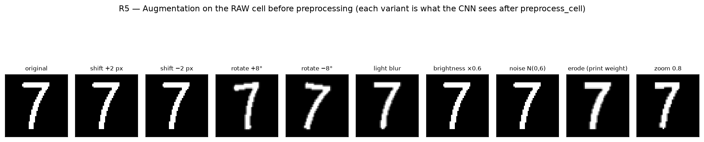

*Figure R5 (Section 5.4). One rendered digit under every augmentation used in training — shift ±2 px, rotation ±8°, blur, brightness, noise, print-weight erosion, zoom — each applied to the RAW cell and then pushed through the same `preprocess_cell` the deployed system uses. Training and inference share this exact code path (the train/inference symmetry that makes the augmentation effective).*

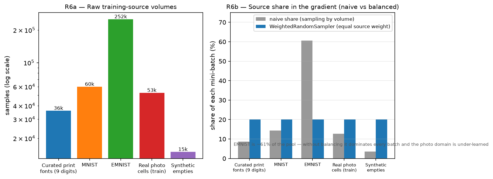

*Figure R6 (Section 5.4). Left: raw training-source volumes (log scale) — EMNIST alone is ~61% of the pool. Right: the naive share each source would have per batch versus the equal weighting enforced by the source-balanced `WeightedRandomSampler`, which keeps any single source from dominating the gradient.*

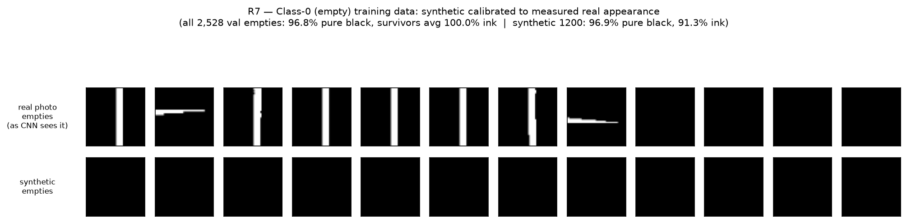

*Figure R7 (Sections 5.3, 5.4). The class-0 (empty cell) training data: real photo empties as the CNN sees them versus synthetic empties. The synthetic generator is calibrated to the measured real appearance — across all validation empties, the large majority are pure black, and the few survivors carry thin line fragments at 5–15% ink (examples shown in the top row).*

## 9. Discussion and Lessons

1. **The evaluation loop drives the design.** Every preprocessing rule in P2 came from studying the benchmark's error montages, and every claim in this document is a benchmark number — the project has no unmeasured opinions.
2. **Primitive techniques remain load-bearing.** Adaptive thresholding and three shape rules did more for empty-cell accuracy (54.3% → 99.8%) than any model change. "Primitive" does not mean obsolete; it means cheap, interpretable, and correctable in minutes.
3. **Train/inference symmetry is non-negotiable.** The shared preprocessing path and the versioned caches/weights are the insurance against silent skew; the mismatch row (Table 1, row 4) shows the cost.
4. **Calibration is a system requirement.** Case B cells poison the correction search; temperature scaling on the deployment-domain validation split made the confidence gate meaningful.
5. **Cascade constraints dominate the headline.** With ~27 givens, digit accuracy must be ~99%; the solve-rate ceiling is a recognition problem, not a solver problem — the oracle diagnostic proves the solver is not the binding constraint.
6. **Honesty in evaluation.** The sealed split, the separate recognition/end-to-end modes, and the no-fallback detection rule mean the reported numbers describe the deployed behavior.

## 10. Status and Refresh Protocol

**Current status (2026-08-10):** the final training run is COMPLETE. The 40-epoch configuration (multi-source, batch 256, early stopping) ran on the sealed 70/15/15 split and early-stopped at 21 epochs; `models/best_model.pt` is its best checkpoint (validation score 0.9933). The exported weights (`models/digit_cnn.pth`) and the refit temperature sidecar (`models/digit_cnn.pth.temperature.json`, T = 1.162) were verified locally and evaluated on the sealed 210-puzzle test: 98.73% definite / 98.44% digit / 99.76% empty, 90.0% exact grids, 87.6% e2e detection (Section 7). All headline numbers in this document are final-run values measured by `benchmark.py`; no number is pending.

**Refresh protocol (after the final run):**

1. ~~Download `digit_cnn.pth` + `digit_cnn.pth.temperature.json` from Colab (notebook cells 12–13) into `models/`.~~ **DONE 2026-08-10** — exported from `models/best_model.pt`; temperature refit locally on the photo-val cache (`emnist/photo_packed_val.npz`).
2. ~~Run the official benchmark...~~ **DONE 2026-08-10** — `results/runs/final_run.log` (both modes), figures `results/figures/final_bench_{recognition,e2e}.png`, cell dumps `results/cells/final_cells_{recognition,e2e}.csv`, montages `results/figures/final_montage_{recognition,e2e}_*.png`.
3. ~~Re-run `make_narrative_figures.py`...~~ **DONE 2026-08-10** — plus `tools/final_metrics_figures.py` (F10/F11 + `narrative_figures/final_metrics.json`).
4. ~~Copy the headline lines...~~ **DONE 2026-08-10** — Section 7 tables and Table 1 (row 9) now hold final values; F10/F11 generated.
5. ~~Update the paper draft's Results and Discussion from Section 7.~~ **DONE 2026-08-10** — `CPECOG1 _Group 4 Project.md` §4.
6. If the model is ever retrained, repeat steps 1–5 and re-export the metrics bundle (`narrative_figures/final_metrics.json`).

## 11. Appendix: Artifact Index

| Artifact | What it proves | Used in |
|---|---|---|
| `results/runs/baseline_run.log`, `results/runs/ab_run.log`, `results/runs/v5_run.log`, `results/runs/v5smoke_run.log`, `results/runs/v5smoke2_run.log`, `results/runs/fix_run_recognition.log` | 24-sample evolution (Table 1, rows 1–6) | §6, §7, F6 |
| `results/runs/gap_smoke_synth_recognition.log`, `results/runs/gap_smoke_photo_recognition.log`, `results/runs/gap_smoke_photo_e2e.log` | Sealed-test smoke results (Table 1, rows 7–8; §7) | §6.5, §6.6, §7 |
| `results/runs/final_run.log`, `results/cells/final_cells_{recognition,e2e}.csv`, `results/figures/final_bench_{recognition,e2e}.png`, `results/figures/final_montage_{recognition,e2e}_*.png` | Sealed-test FINAL results (Table 1, row 9; §7; F10/F11) | §6.6, §7, §8 |
| `narrative_figures/final_metrics.json` | Complete final-run metrics bundle (model facts + both modes + confusion matrix + positions) | §7, §8 |
| `models/best_model.pt` + `models/digit_cnn.pth` + `.temperature.json` | Final 21-epoch checkpoint, exported weights, refit temperature (T=1.162) | §6.6, §7 |
| `results/cells/*_cells_recognition*.csv` | per-cell diagnostics (threshold path, ink, removals) | §5.3, F6, F8 |
| `results/figures/*_montage_*.png` | preprocessing error groups per generation | §5.2, §5.3, F4b–F4d |
| `results/figures/bench_*.png`, `results/figures/fix_*.png`, `results/figures/smoke_figure_*.png` | per-puzzle benchmark grid figures | F5 |
| `results/figures/v5_3bor_wrongcells_montage.png` | the one consistently-regressing puzzle (17-cell stage montage) | §5.7, F8 |
| `photo_splits.json` | sealed 980/210/210 partition (seed 42) | §4.4 |
| `emnist/photo_packed_{train,val}.npz` | per-partition photo cell caches (52,685 / 11,735) | §5.4 |
| `emnist/emnist_packed.npz` | versioned EMNIST cache (official train/test separate) | §5.4 |
| `models/*.temperature.json` | fitted temperatures, auto-loaded | §5.6 |
| `narrative_figures/` | figures F2, F3, F4a, F6–F9 + `t1_metrics.json` | §8 |
| `narrative_figures/ref_r*.png` | intro-ML reference figures R1–R7 (thresholding, calibration, training history, architecture, augmentation, data balance, empties) | §8.3 |
| `emnist/photo_packed_test.npz` | sealed-test definite-cell cache (11,414 cells) — built by `make_reference_figures.py` via `photo_data.build_photo_cells("test")` | §5.6, R2 |
| `live_solver.py` | real-time GUI deployment of the pipeline (camera/upload, overlay + panels, `--smoke` health check) | §3.1 |

---

*Companion material: `README.md` (usage), `AGENTS.md` (code-level details and gotchas), `CPECOG1 _Group 4 Project.md` (paper draft).*
